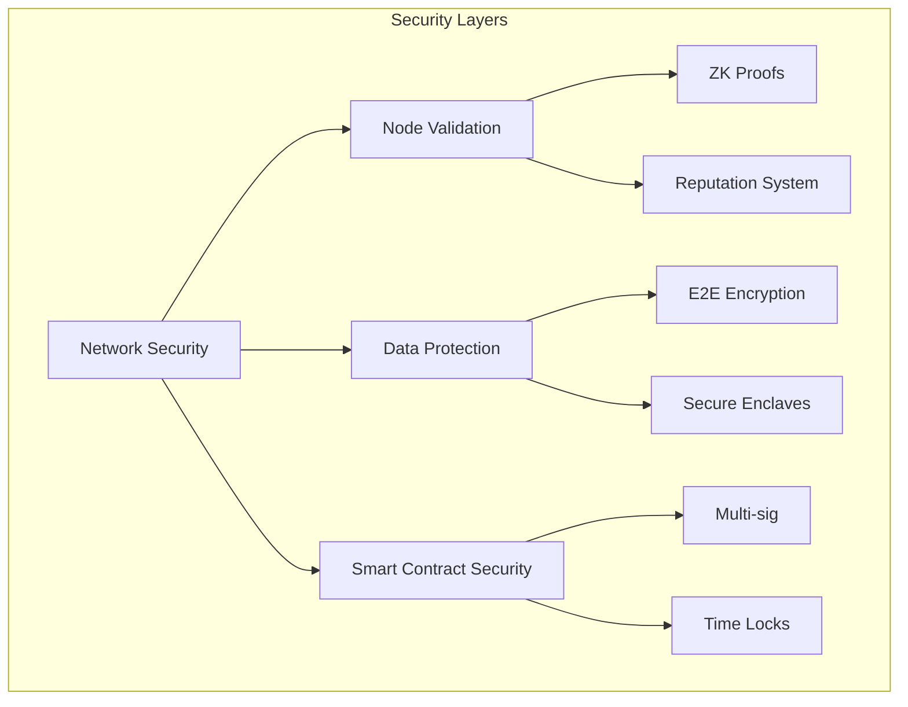

# 8. Platform Security

## Security Measures

### Multi-Layer Security Model


### Network Security
1. DDoS Protection
   ```markdown
   - CloudFlare Enterprise Protection
   - Rate limiting
   - Traffic analysis
   - Automated mitigation
   ```

2. Encryption Standards
   ```typescript
   interface EncryptionStandards {
     asymmetric: {
       algorithm: "Ed25519",
       keySize: 256,
       usage: ["NodeIdentity", "TaskSigning"]
     },
     symmetric: {
       algorithm: "AES-GCM",
       keySize: 256,
       usage: ["DataEncryption", "SessionKeys"]
     }
   }
   ```

### Node Security
1. Validation Protocol
```typescript
class NodeValidator {
  async validateNode(
    nodeId: string, 
    capabilities: NodeCapabilities
  ): Promise<ValidationResult> {
    // Hardware validation
    const gpuValidation = await this.validateGPUCapabilities(capabilities.gpu);
    
    // Network performance verification
    const networkMetrics = await this.measureNetworkPerformance(nodeId);
    
    // Proof of stake verification
    const stakeVerification = await this.verifyStake(nodeId);
    
    return {
      isValid: this.checkAllValidations([
        gpuValidation,
        networkMetrics,
        stakeVerification
      ]),
      metrics: {
        performance: gpuValidation.metrics,
        network: networkMetrics,
        stake: stakeVerification.amount
      }
    };
  }
}
```

2. Security Monitoring
   - Real-time threat detection
   - Behavioral analysis
   - Anomaly detection
   - Automated response

## Privacy Policy

### Data Collection
1. User Data
   ```markdown
   - Account information
   - Transaction history
   - Performance metrics
   - Usage statistics
   ```

2. System Data
   ```markdown
   - Node performance
   - Network metrics
   - Resource utilization
   - Error logs
   ```

### Data Protection
1. Storage Security
   ```typescript
   interface StorageSecurity {
     encryption: {
       atRest: "AES-256",
       inTransit: "TLS 1.3"
     },
     access: {
       authentication: "Multi-factor",
       authorization: "Role-based"
     },
     backup: {
       frequency: "Daily",
       retention: "90 days"
     }
   }
   ```

2. Access Control
   - Role-based access
   - Principle of least privilege
   - Regular access reviews
   - Audit logging

## Terms of Service

### User Agreements
1. Platform Usage
   ```markdown
   - Acceptable use policy
   - Resource limits
   - Performance requirements
   - Compliance obligations
   ```

2. Service Level Agreements
   ```markdown
   - Uptime guarantees
   - Performance metrics
   - Support response times
   - Compensation terms
   ```

## Risk Management

### Risk Assessment
1. Technical Risks
   ```markdown
   - Network failures
   - Hardware malfunction
   - Software vulnerabilities
   - Performance degradation
   ```

2. Operational Risks
   ```markdown
   - Resource availability
   - Service disruption
   - Data integrity
   - System capacity
   ```

### Mitigation Strategies
1. Technical Solutions
```typescript
interface RiskMitigation {
  networkSecurity: {
    measures: [
      {
        risk: 'DDoS Attacks',
        solution: 'CloudFlare Enterprise Protection',
        implementation: 'Real-time',
        cost: 'Enterprise'
      },
      {
        risk: 'Data Breaches',
        solution: 'End-to-end Encryption',
        implementation: 'Continuous',
        cost: 'Standard'
      }
    ]
  },
  platformStability: {
    measures: [
      {
        risk: 'Performance Issues',
        solution: 'Auto-scaling Infrastructure',
        implementation: 'Automated',
        cost: 'Variable'
      }
    ]
  }
}
```

2. Operational Procedures
   - Incident response plan
   - Business continuity plan
   - Disaster recovery plan
   - Regular audits

## Compliance

### Regulatory Compliance
1. Standards Adherence
   ```markdown
   - GDPR compliance
   - SOC 2 certification
   - ISO 27001 standards
   - Industry regulations
   ```

2. Audit Procedures
   ```markdown
   - Regular security audits
   - Compliance reviews
   - Performance audits
   - External assessments
   ```

### Security Updates
1. Update Management
   ```markdown
   - Regular security patches
   - Critical updates
   - Feature updates
   - System maintenance
   ```

2. Communication Protocol
   ```markdown
   - Security advisories
   - Update notifications
   - Maintenance schedules
   - Incident reports
   ```
